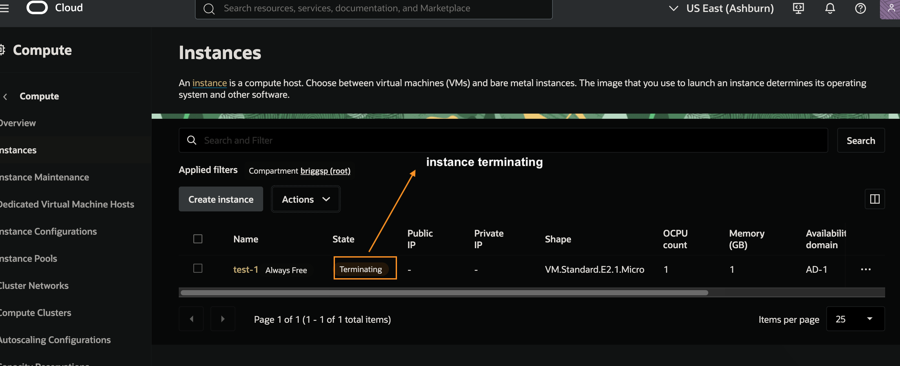
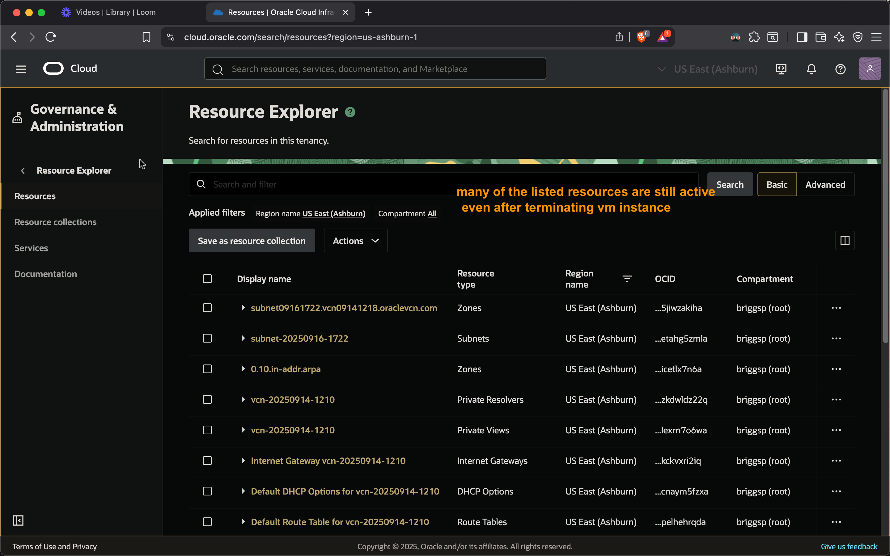
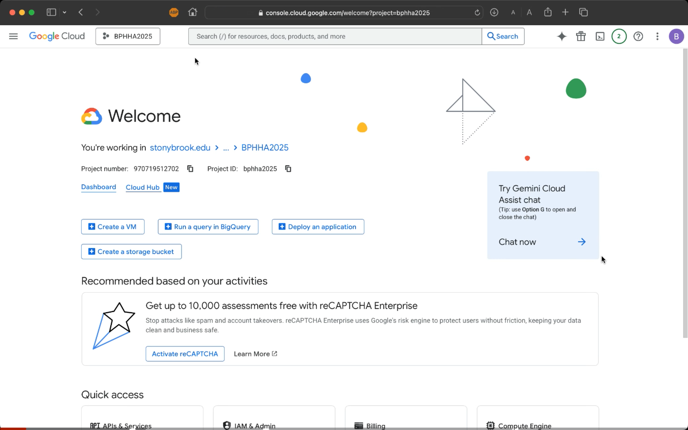
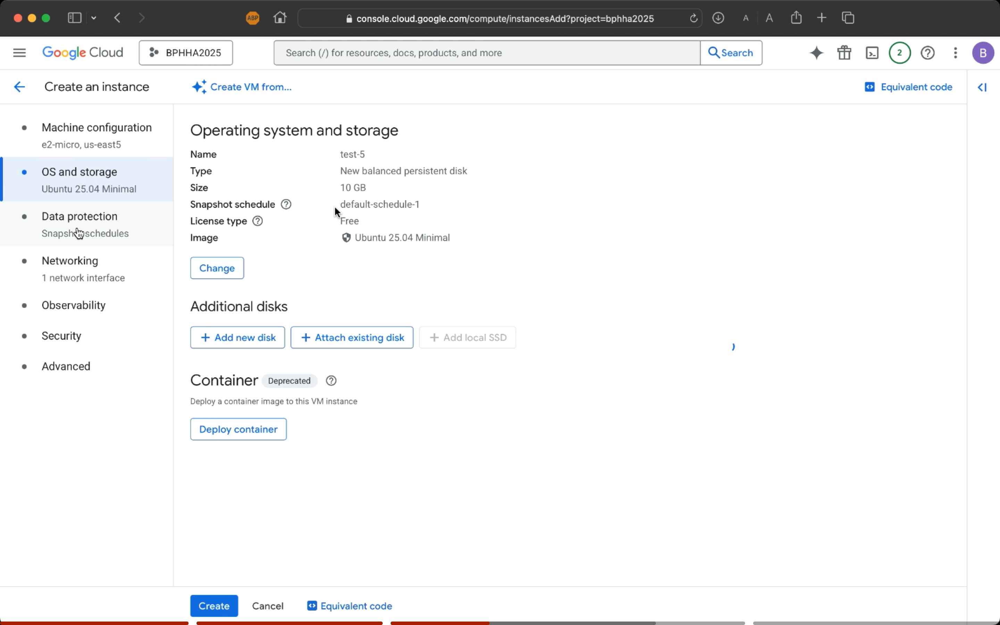
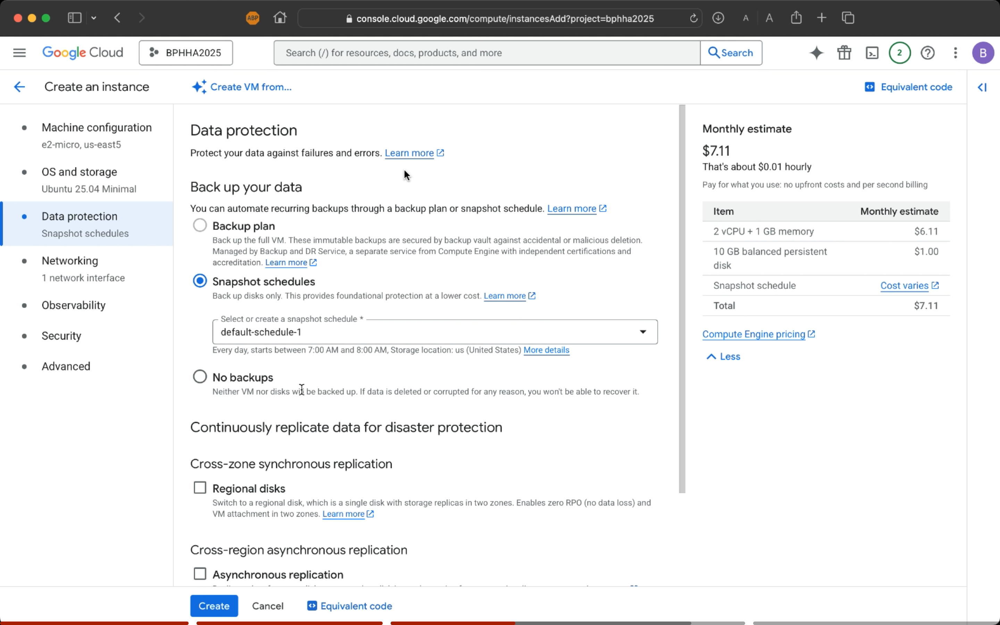

# OCI & GCP basic Virtual Machine (VM) setup 
*Created from a .edu account and by selecting the bare minimum resources/options for least billing.*

## **Video Walkthrough**

### OCI - Oracle Cloud Infastructure

  <a style="float: left;">
  Creating a Virtual Machine on Oracle Cloud Infrastructure ☁️
  </a>
  
  

### GCP - Google Cloud Platform

  <a style="float: left;">
  Creating a Virtual Machine on Google Cloud ☁️
  </a>
  
  

 
 

  
Prerequisites
  
 

- Access to GCP and OCI cloud consoles
- $ Credits (and educational affiliation to get credits)  
- Basic and least-expensive/free-tier/smallest VM configurations
- Compliance to all healthcare related regulations, especially with PHI/PII data

## **VM configuration and creation steps**

## Oracle Cloud Infrastructure (OCI)

  
Configuration
  
 

1. **Compartment**: `briggsp`  
3. **Shape**: `VM.Standard.E2.1.Micro`
4. **Image**: `Ubuntu`  
5. **Public IP**: `Ephemeral IPv4`
2. **Networking**: `Virtual Cloud Network (VCN) with default security configuration`
6. **Boot Volume**: `Default minimal`

  
VM creation in Images
  
 

Steps 1 to 19 (Click on an image to view the full size image)

| 1 ACCOUNT  | 2 Navigation  |
|--------------------------------------------------|--------------------------------------------------|
| 3 Create INSTANCE  | 4 BASIC INFO  |
| 5 Select IMAGE  | 6 UBUNTU  |
| 7 Image Name  | 8 Select SHAPE  |
| 9 All Shapes  | 10 Shape Name  |
| 11 SECURITY  | 12 NETWORKING  |
| 13 SSH  | 14 BOOT Volume  |
| 15 REVIEW  | 16 Work Requests  |
| 17 Instances List  | 18 Navigation  |
| 19 DASHBOARD  | 

  
OCI VM lifecycle management
  
 

| 1 VM-Provisioning  | 2 VM Created  |
|--------------------------------------------------|--------------------------------------------------|
| 3 VM Running  | 4 VM Stopped ) |
| 5 VM Terminating  | 7 VM Terminated  |
| 7 OCI Resources  | 

---

## Google Cloud Platform (GCP) 

  
Configuration
  
 

1. Navigate to: **Console → Compute Engine → Create Instance**  
2. **Region/Zone**: `us-east (Columbus)` / `Default`
3. **Machine Type**: `(General Purpose) e2-micro` (2 vCPU, 1 core, 1 GB memory)  
4. **Image**: `Ubuntu LTS`  
5. **Boot Disk**: `Default minimal`  
6. **Network**: `Default Ephemeral IPv4`
7. **CostMonthly Estimate**: `$7.11` with variable cost for data protection with snapshot schedule

  
VM creation in Images
  
 

Steps 1 to 14 (Click on an image to view the full size image)

| 1 ACCOUNT  | 2 VM Instance  |
|--------------------------------------------------|--------------------------------------------------|
| 3 Create INSTANCE  | 4 Machine Configuration  |
| 5 Cost Optimized View  | 6 OS STORAGE  |
| 7 DATA PROTECTION  | 8 NETWORKING  |
| 9 OBSERVABILITY  | 10 SECURITY  |
| 11 Advanced  | 12 VM Created  |
| 13 OBSERVABILITY  | 14 OVERVIEW  |

  
GCP VM lifecycle management
  
 

| 1 VM Running  | 2 VM Stopped  |
|--------------------------------------------------|--------------------------------------------------|
| 3 VM Actions  | 4 VM Deleted  |
| 5 Operations List   | 6 Overview  |

## Reflections

  
Key Similarities in VM setup
  
 

- Education credits for free usage
- Custom VM configuration
- VM Creation steps similar in nature and flow
- Region, Zone and VM specification setup
- Customization 
- Differentiate between ephemeral and static IP's
- Offer private default private networks with internet access
- Global datacenter presence supporting multi-region deployments
- Auto scaling capabilities

  
Key Differences in VM setup
  
 

- OCI has a technical VM setup than GCP.
- OCI provides for creating variables like subnet if not auto-populated; GCP does not offer this, suggesting these variables get resolved automatically in the backend
- OCI containers are tenancy-name/root; GCP container is autogenerated in the backend
- GCP offers a cost estimate and configuration snapshot throughout the VM creation process; OCI does not
- GCP is more user friendly with a better UI and UX compared to OCI
- GCP overview and dashboard view, both very comprehensive
- GCP has a configurable observability feature offering resources usage from various angles
- SSH keys and configuration is auto generated in GCP. In OCI it is manually done with SSH kep downloaded manually
- GCP has more OS variety than GCP

## Discussion

OCI appears to provide lower cost VM instances (reduces costs). GCP offers a wider global reach and strong analytics capabilities and other bells and whistles for AI capabilities. GCP has a better UI and UX. GCP has more analytics capabilities. GC seems to offer more customization and scalability options. It is also easier to migrate VM instances into GCP from other platforms. GCP seems more user friendly. Overall, between OCI and GCP, GCP seems a better option with the AI and bigdata capabilities and opportunities. OCI seems to be a no frills option for cost reduction and for needs that are not that variable in classic industries.  

